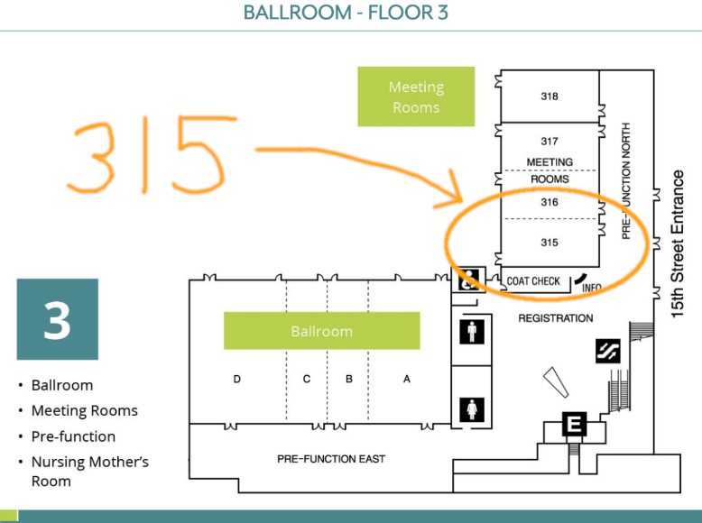
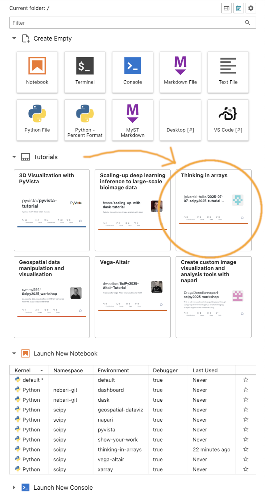
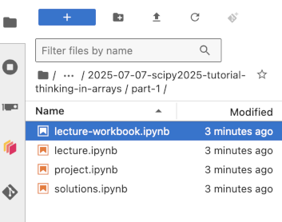
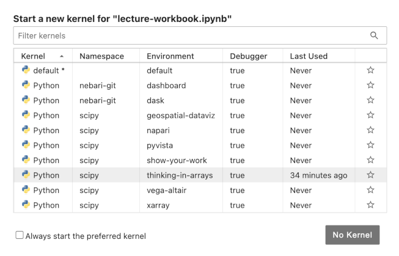

# SciPy 2025 tutorial: Thinking in arrays

This repository contains everything you need to follow the "[Thinking in arrays](https://cfp.scipy.org/scipy2025/talk/MP7C33/)" tutorial, presented at the [SciPy 2025](https://www.scipy2025.scipy.org/) conference on [Monday, July 7 at 8:00am‒12:00pm PDT](https://www.scipy2025.scipy.org/schedule) in Room 315.



## Recommended: run the notebooks on Nebari

(See [the SciPy Nebari Google Doc](https://docs.google.com/document/d/19LmkiwoRu_JOHxHPbf1wMXGIU9pspQbqUqj-icny3JE/edit?usp=sharing) for general instructions.)

Attendees of the SciPy conference should all have access to Quansight's Nebari at [https://scipy.quansight.dev](https://scipy.quansight.dev). Log in (and allow several minutes for your instance to launch) and select the "Thinking in Arrays" tutorial from the grid of choices:



Then navigate to `tutorials/2025-07-07-scipy2025-tutorial-thinking-in-arrays/part-1/lecture-workbook.ipynb`:



Then select the `thinking-in-arrays` kernel when your notebook opens:



We will present from `lecture.ipynb`, but `lecture-workbook.ipynb` is your scratchpad for exercises before the `project.ipynb`. Don't look at `solutions.ipynb` until after you've attempted the project!

## Alternative: run the notebooks on your computer with `pixi`

First, clone this repository.

```shell
git clone https://github.com/jpivarski-talks/2025-07-07-scipy2025-tutorial-thinking-in-arrays.git
cd 2025-07-07-scipy2025-tutorial-thinking-in-arrays
```

Make sure you've [installed pixi](https://pixi.sh/latest/installation/) on your computer.

Then you can install the environment and start a local JupyterLab session with:

```shell
pixi run start
```

## Preliminary outline

* **0:00‒0:15 (15 min)** Lecture 1: Array-oriented programming and its benefits. Simple and complex (3 body problem) examples of imperative, functional, and array-oriented styles. Speed and memory advantages in Python. What the array-oriented paradigm emphasizes/is good for: interactive analyses of distributions. Path length as a worked example.
* **0:15‒0:35 (20 min)** Project 1: Conway’s Game of Life using arrays. Imperative solution is given, as is an initial condition that makes boundary conditions unimportant, simplifying the problem. Students’ array-oriented solutions should be much faster than imperative Python. For extra glory, there’s a slick solution involving convolutions.
* **0:35‒0:45 (10 min)** Break.
* **0:45‒1:00 (15 min)** Solutions to project 1. Show manual solution without boundary conditions first, then boundary conditions, then the slick solution involving convolutions.
* **1:00‒1:15 (15 min)** Lecture 2: Disadvantages of array-oriented programming. (1) The problem of intermediate arrays, shown using the quadratic formula, with timing, compared to pre-compiled C code. (2) The “iterate until converged” problem, shown using a one-dimensional minimizer (Newton’s method) for an array of initial states; talk about epochs in ML.
* **1:15‒1:35 (20 min)** Project 2: Iterative computations on arrays. Given imperative and array-oriented implementations of a special function (incomplete gamma) that has to iterate until converged, ask for one that prevents unnecessary calculations by keeping track of which array elements have already converged.
* **1:35‒1:45 (10 min)** Break.
* **1:45‒2:00 (15 min)** Solutions to project 2. Show a working example with bookkeeping and compare timings with and without.
* **2:00‒2:15 (15 min)** Lecture 3: JIT-compilation with Numba and JAX. Describe JIT-compilation as the solution to the intermediate array problem (1). First Numba then JAX on the quadratic formula. Show that Numba only accelerates if you write imperative code, unlike JAX, and show that JAX can’t follow if-branches or loops of unknown length.
* **2:15‒2:35 (20 min)** Project 3: JIT-compilation of the Mandelbrot set. Given imperative Python and array-oriented NumPy with timings, ask for a faster version using Numba and JAX.
* **2:35‒2:45 (10 min)** Break.
* **2:45‒3:00 (15 min)** Solutions to project 3. Show the full “Mandelbrot on all accelerators” and note that array-oriented programming is advantageous for GPU programming, even beyond Python.
* **3:00‒3:15 (15 min)** Lecture 4: Ragged and deeply nested arrays. Show examples of ragged, nested, missing, and heterogeneous data, and how it can still make sense to treat them as arrays. Conversion to and from “tidy” data (tabular with references) to compare and contrast.
* **3:15‒3:35 (20 min)** Project 4: Exploring data in ragged arrays. Compute path lengths of taxi trips from Parquet files.
* **3:35‒3:45 (10 min)** Break.
* **3:45‒4:00 (15 min)** Solutions to project 4. Afterward, see https://github.com/hsf-training/array-oriented-puzzles for more fun!
